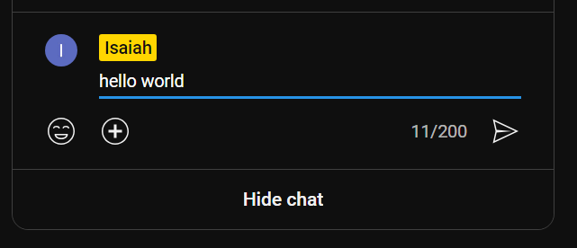
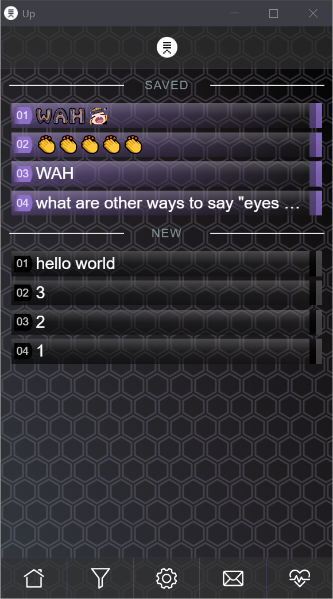
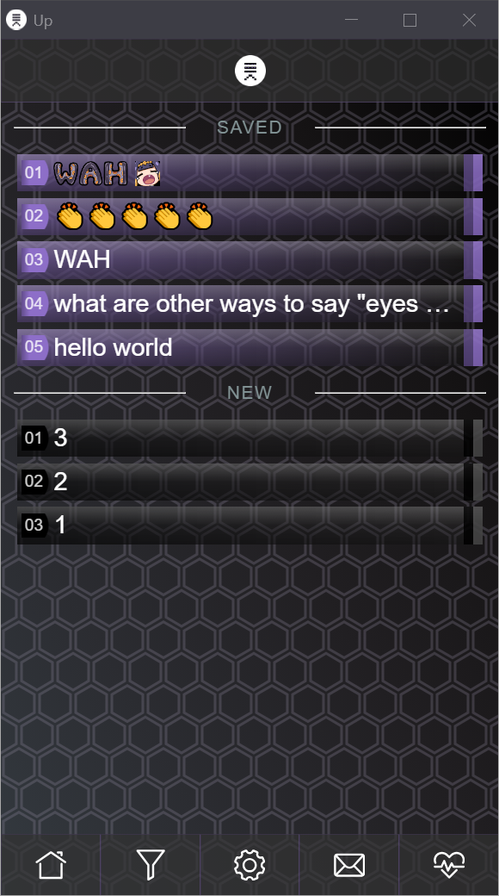
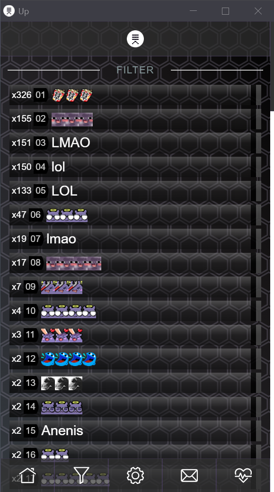
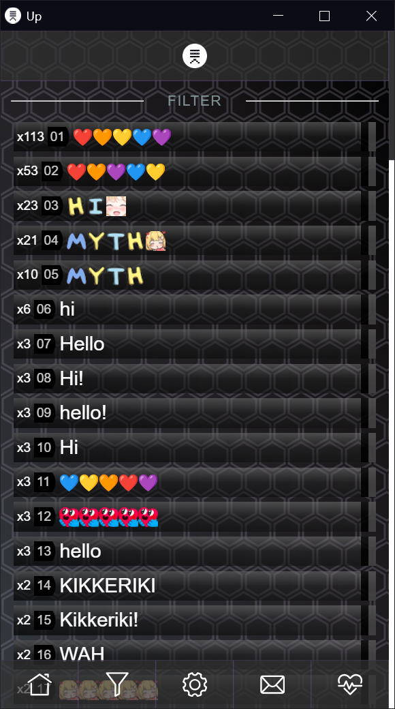

# UP
Input recall for chat
- youtube live chat
- twitch
- chatGPT

### How to use
1. Click/input in the chat field to apply new functionality

### up
1. When an input is removed with enter, it is added to your recall history
2. Press up in the chat field to get previously typed input

### paste
1. Open the extension
2. Click on any list item once to paste it into the chat field

### save

    

    

### filter

     

